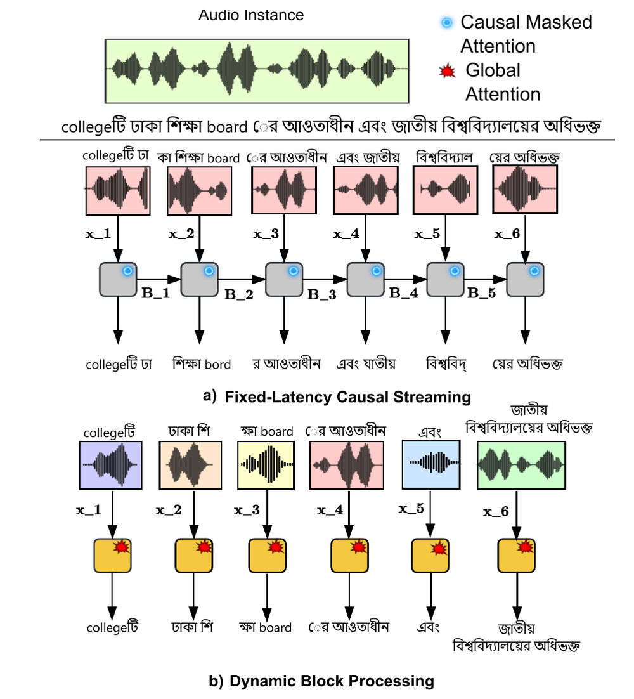
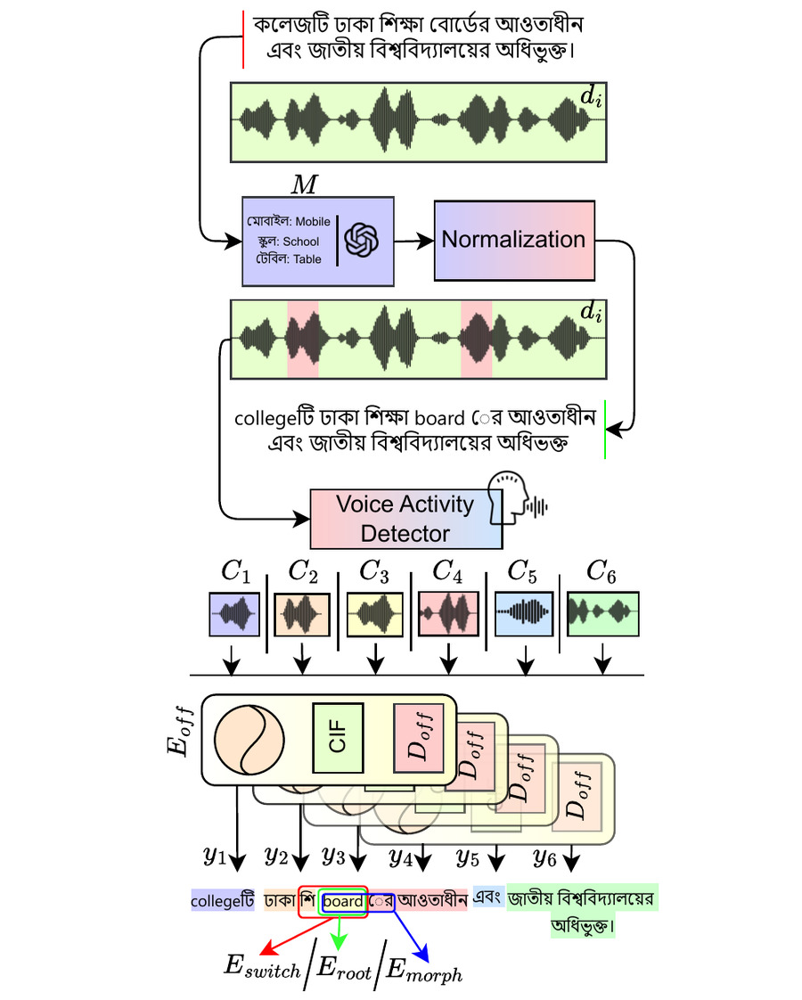
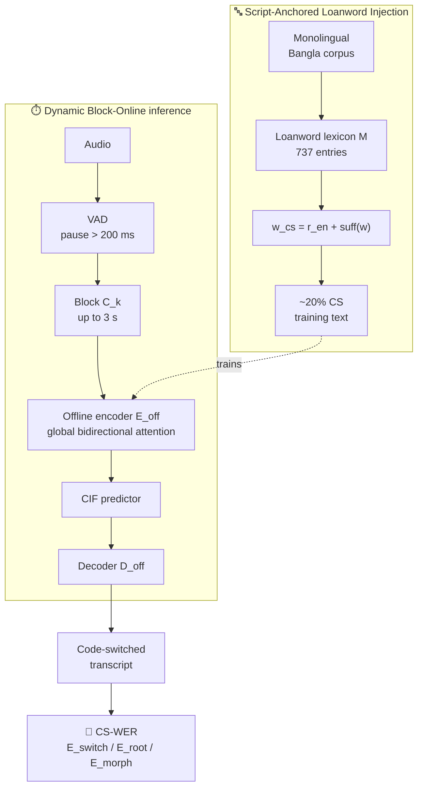
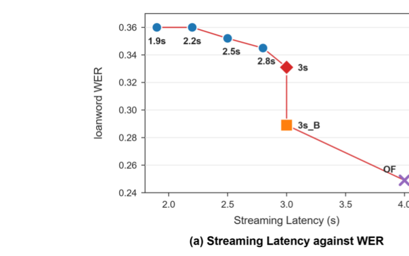
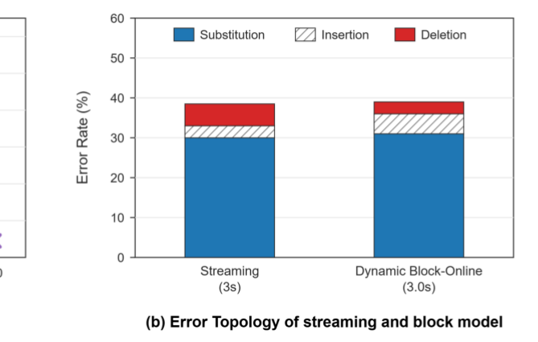
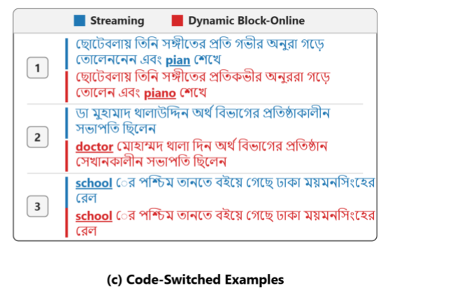

<div align="center">

<br>

# 🎙️ Dynamic Block-Online Streaming ASR

### for Low-Resource Agglutinative Code-Switching Speech, with Morphology-Aware Evaluation

**VAD-aligned blocks** ✚ **global attention inside the block**
**=** streaming ASR that stops slicing Bangla words in half

<br>

[](https://www.interspeech2026.org/)
[](https://www.interspeech2026.org/)
[](https://github.com/King-Rafat/Dynamic_Streaming_ASR)

[](https://www.python.org/)
[](https://github.com/modelscope/FunASR)
[](https://arxiv.org/abs/2206.08317)
[](#-data)
[](https://doi.org/10.5281/zenodo.XXXXXXX)
[](LICENSE)
[](https://github.com/King-Rafat/Dynamic_Streaming_ASR/stargazers)

<br>

**Kazi Rafat**<sup>1,✉</sup> · Afifa Imran<sup>1</sup> · Md. Ismail Hossain<sup>1</sup> · Md. Romzan Ali<sup>1</sup>
Fuad Rahman<sup>2</sup> · Sifat Momen<sup>1</sup> · Shafin Rahman<sup>1</sup> · Nabeel Mohammed<sup>1</sup>

<sub><sup>1</sup> Apurba NSU R&D Lab, North South University, Dhaka, Bangladesh<br>
<sup>2</sup> Apurba Technologies, Dhaka, Bangladesh</sub>

<br>

[**Method**](#-method) · [**CS-WER**](#-fine-grained-cs-wer) · [**Results**](#-results) · [**Models**](#-models) · [**Quick start**](#-quick-start) · [**Citation**](#-citation)

</div>

<br>

<p align="center">
  
</p>

<p align="center"><sub><b>(a)</b> Fixed-latency causal streaming. Memory-cached attention truncates morphemes, mistranscribing <b>ঢাকা</b> and <b>board</b>.<br><b>(b)</b> Our dynamic block processing, where VAD-aligned global attention resolves long-form agglutinative dependencies.</sub></p>

<br>

<div align="center">

| | Causal Streaming (3 s) | **Dynamic Block-Online** | |
|:--|:--:|:--:|:--|
| **Global WER** | **37.20** ✅ | 38.73 | *WER says streaming wins* |
| **`E_root`** | 0.35 | **0.29** ✅ | *−6 % absolute* |
| **`E_morph`** | 0.42 | **0.35** ✅ | *−7 % absolute* |

**WER called it a tie. CS-WER showed a 7-point morphological gap underneath.**

</div>

---

## 📌 TL;DR

Bangla glues a **root** and a stack of **suffixes** into one word, and speakers drop English words into the middle of sentences (`collegeটি`, `boardএ`, `managerের`). A streaming model listening in **fixed 600 ms chunks** cuts those words in half, commits to a guess, and can never look back. In an agglutinative language the *ending* is what confirms the beginning, so committing early is fatal.

So we stop cutting on a stopwatch. A **Voice Activity Detector** cuts on real pauses, and full **bidirectional attention** runs *inside* each block.

<table>
<tr>
<td width="33%" valign="top">

### ⏱️ Dynamic latency

Blocks trigger on pauses **> 200 ms** and extend to a **3 s** macro-block. Conversational Bangla phrases run 1.5–2.0 s, so the cap is rarely hit. Latency is **data-dependent, not fixed**.

</td>
<td width="33%" valign="top">

### 🔤 Script *is* the tag

Script-Anchored Loanword Injection keeps the English root in Latin and the Bangla suffix in Bengali. No `<en>`/`<bn>` tokens, which we show **actively hurt** the CIF predictor.

</td>
<td width="33%" valign="top">

### 🔬 WER hid the win

CS-WER splits error into **switch**, **root**, and **morphology**. It exposes a 6–7 % morphological gap that global WER reports as a tie.

</td>
</tr>
</table>

---

## 🧨 The finding that matters

Push the causal streaming window out to 3 s and its **global WER (37.20) beats ours (38.73)**. On WER alone, our method looks like it loses.

It does not. CS-WER shows streaming saturating at a ceiling it cannot cross. A large causal window captures general acoustics, which is what WER rewards, but the causal mask still stops the model binding a suffix back to its root after the fact. That is the **morphological plateau**, and only bidirectional attention inside a VAD-aligned block breaks it.

> [!IMPORTANT]
> **If we had reported WER only, we would have concluded our own method failed.**
> This is the argument for the metric, and the reason this repository exists.

---

## 🏗️ Method

<p align="center">
  
</p>



### Why the receptive field matters

| | Receptive field for frame `t` | Can it fix a root after hearing the suffix? |
|---|---|---|
| Causal streaming | chunk `C_k` + memory bank `B_{k−1}` | ❌ No. Alignment drift is irreversible. |
| **Dynamic block-online** | `R(h_t) = { x_i \| x_i ∈ C_block }` | ✅ Yes. The whole semantic unit is in scope. |

---

## 📐 Fine-Grained CS-WER

Standard WER treats all errors equally. A model that nails the English root but botches the suffix is doing something completely different from one that misses the switch entirely.

<div align="center">

| Component | Measures | Counted correct when |
|:---|:---|:---|
| 🔀 `E_switch` | Stability of the context around the embedded word | The bigram (preceding word, English word) is reproduced |
| 🌱 `E_root` | Lexical accuracy of the English root, ignoring the suffix | The core English entity is identified |
| 🧬 `E_morph` | Full agglutinative structure | **Both** root and Bangla suffix are correct and validly segmented |

</div>

Detection is **script-anchored**: a token is a CS instance if it contains Latin characters, and the Latin→Bengali transition inside a token *is* the morpheme boundary.

> [!NOTE]
> **Every English token is a code-switch instance, and `E_switch` looks beyond the single Bangla→English bigram.**
>
> All three components share one denominator, the number of English tokens in the reference. That is why the tuple `.53 / .29 / .35` is internally comparable.
>
> `E_switch` is evaluated at *every* embedded token, not only the first one after Bangla. In a multi-word English island like `board meeting`, both are scored:
>
> | Instance | Bigram checked | What it tests |
> |---|---|---|
> | `board` | (Bangla word, `board`) | entry into the embedded language |
> | `meeting` | (`board`, `meeting`) | the island is held together, not abandoned mid-way |
>
> Restricting `E_switch` to the matrix→embedded boundary alone would miss the second failure, which is exactly where a causal streaming model tends to bail out. A reimplementation that scores only the first English word per island will produce a different, and less informative, `E_switch`.

> [!WARNING]
> **Normalise punctuation on both sides before scoring.** References and hypotheses must both be punctuation-stripped, which is standard ASR text normalisation and is what produced the results below.
>
> The script boundary inside a token is read as the morpheme boundary, so a reference keeping a danda (`hospital।` → suffix `।`) while the hypothesis does not (`hospital` → suffix `<EOS>`) would fail the suffix comparison on punctuation alone. This is a requirement on the input, not something the scorer corrects.

### Usage

```python
from cs_wer.script_morph_wer import ScriptMorphWER

scorer = ScriptMorphWER()
results = scorer.compute_batch(references, hypotheses)
# {'CS-WER (Morph)': 0.665, 'CS-WER (Root)': 0.529,
#  'CS-WER (Switch)': 0.797, 'Total CS Instances': 1616}
```

```bash
# results table with `sentence` (reference) and `outputs` (hypothesis) columns
python cs_wer/script_morph_wer.py --file results.xlsx

# or two parallel text files
python cs_wer/script_morph_wer.py --ref refs.txt --hyp hyps.txt

python tests/test_cs_wer.py     # sanity checks
```

Counts accumulate across the corpus and are divided once (micro-average). Matching consumes each hypothesis item at most once, so repeated loanwords cannot be double-credited.

<details>
<summary><b>Implementation notes for reimplementers</b></summary>

<br>

The code in `cs_wer/script_morph_wer.py` is the exact scorer used for the paper, unmodified.

**English roots are assumed to be a single Latin run.** The suffix is taken as the first non-Latin run inside the token, and that run is not checked for being Bangla. A root containing an internal hyphen, apostrophe, or space is therefore truncated:

| Token | Root captured | Suffix captured |
|---|---|---|
| `collegeটি` | `college` ✅ | `টি` ✅ |
| `x-rayের` | `x` | `-` |
| `follow-upটি` | `follow` | `-` |
| `ma'amকে` | `ma` | `'` |
| `thank youই` | scored as two instances | |

Five of the 737 lexicon entries are affected (**X-ray, T-shirt, Follow-up, Ma'am, Thank you**), roughly **0.3 % of code-switch instances**. It is applied identically to references and hypotheses, so model comparisons are unaffected.

**`compute_batch` returns a 4-tuple, not a dict, if the corpus contains no English tokens at all.** This never occurs on a real code-switching test set.

</details>

---

## 🔤 Script-Anchored Loanword Injection

CS training data for Bangla barely exists. Instead of splicing English audio into Bangla utterances, which produces acoustically mismatched data that hinders convergence, we rewrite the **text** and leave the audio untouched.

For a Bangla token `w = root(w) ⊕ suff(w)`, if `root(w)` has an English equivalent `r_en` in lexicon `M`:

<div align="center">

$$w_{cs} = r_{en} \oplus \text{suff}(w)$$

| Original Bangla | → | Code-switched | What happened |
|:---|:---:|:---|:---|
| কলেজটি | → | `college`টি | root swapped, suffix kept |
| ডাক্তারকে | → | `doctor`কে | root swapped, suffix kept |
| ম্যানেজারের | → | `manager`ের | root swapped, suffix kept |

</div>

Syntax is preserved and the script boundary *is* the morpheme boundary, which is exactly what CS-WER later exploits. Applied across the corpus this yields **≈ 20 % CS sentences**.

📁 **[`data/loanwords.json`](data/loanwords.json)** — **737 entries** spanning conversation, education, office, transport, technology, food, sport, media, and health.

---

## 📊 Results

Common Voice Bengali. `B+E` = monolingual training, `C` = loanword injection, `aug` = augmentation.
CS-WER is `E_switch / E_root / E_morph`. **Lower is better throughout.**

| Model | Data | `w` | CER ↓ | WER ↓ | CS-WER ↓ |
|:---|:---:|:---:|:---:|:---:|:---:|
| <sub>▸ **WHISPER OFFLINE**</sub> | | | | | |
| Large-v3 | – | Full | – | 40.30 | .94 / .96 / .97 |
| Large-v2 | – | Full | – | 62.31 | .98 / .94 / .99 |
| <sub>▸ **OTHERS OFFLINE**</sub> | | | | | |
| MBNSpeech | – | Full | 11.44 | 42.3 | 1 / 1 / 1 |
| MMS | – | Full | 14.72 | 48 | 1 / 1 / 1 |
| <sub>▸ **PARAFORMER OFFLINE**</sub> | | | | | |
| + 750h + FC | B+E | Full | 12.19 | 34.81 | .92 / .87 / .90 |
| + 750h + FC | B+E+C | Full | 12.69 | 33.32 | .53 / .29 / .36 |
| + aug | B+E+C | Full | 🥇 **11.05** | 🥇 **31.14** | 🥇 **.46 / .25 / .31** |
| <sub>▸ **PARAFORMER STREAMING**</sub> | | | | | |
| + 200h | B+E | 600 ms | 26.88 | 60.90 | 1 / .99 / 1 |
| + 200h | B+E+C | 600 ms | 27.97 | 61.44 | .72 / .61 / .67 |
| + 200h + LID | B+E+C | 600 ms | 33.45 | 64.78 | .75 / .67 / .87 |
| + 200h + WLID | B+E+C | 600 ms | 34.57 | 65.18 | .75 / .67 / .87 |
| + 750h | B+E+C | 600 ms | 22.96 | 51.72 | .69 / .50 / .53 |
| + 750h | B+E+C | 800 ms | 21.41 | 49.43 | .68 / .48 / .55 |
| + 750h | B+E+C | 2 s | 20.19 | 48.88 | .66 / .44 / .51 |
| + 750h | B+E+C | 2.4 s | 18.17 | 47.45 | .64 / .42 / .48 |
| + aug | B+E+C | 2 s | 16.33 | 41.45 | .62 / .36 / .44 |
| + aug | B+E+C | 2.4 s | 14.67 | 39.45 | .60 / .36 / .43 |
| + aug | B+E+C | 3 s | **14.27** | **37.20** | .58 / .35 / .42 |
| <sub>▸ **DYNAMIC BLOCK PARAFORMER** (ours)</sub> | | | | | |
| **+ 750h + aug** | B+E+C | 3 s | 15.62 | 38.73 | 🏆 **.53 / .29 / .35** |

<table>
<tr>
<td width="34%"></td>
<td width="33%"></td>
<td width="33%"></td>
</tr>
<tr>
<td><sub><b>(a) Latency vs loanword WER.</b> Streaming (circles) plateaus; block-online (square) and offline (cross) sit below the curve.</sub></td>
<td><sub><b>(b) Error topology.</b> Deletions (red) collapse from ≈7 % to &lt;2 %, converting into substitutions.</sub></td>
<td><sub><b>(c) Real outputs.</b> Streaming (blue) writes <i>pian</i>; block-online (red) recovers <b>piano</b> and <b>doctor</b>.</sub></td>
</tr>
</table>

### 🔻 Deletions become substitutions

Causal streaming is dominated by **deletions** (≈ 7 %) as the CIF predictor discards suffixes and code-switches sitting on chunk boundaries. Dynamic Block-Online pushes deletions below **2 %**, converting them into substitutions.

Global WER penalises both equally. For an agglutinative language that trade is strongly favourable: a phonetic substitution preserves the morphological slot and the code-switched semantics, while a **deletion destroys them**. This is semantic recovery the WER metric does not reflect.

### 💉 Injection ablation

<div align="center">

| Setting | Loanword error, offline | Loanword error, online |
|:---|:---:|:---:|
| Monolingual transcripts only (B+E) | 87 % | 99 % |
| **+ Script-Anchored Injection** | **≈ 25 %** ⬇ | **61 %** ⬇ |

</div>

Without injection the model simply transliterates English into Bengali script. Injection transforms the task from transcription into **discriminative language switching**.

### 🏷️ Explicit LID tags hurt

Discrete `<en>` / `<bn>` tags destabilise the CIF predictor by interrupting its continuous energy accumulation and disrupting alignment paths. Weighted loss on LID tokens gives similar results, so the limitation is **architectural, not an optimisation artifact**. Implicit script anchoring suits energy-based NAR architectures better.

---

## 🩺 Domain adaptation: menstrual & menopausal health

A high-perplexity domain with critical low-frequency English medical entities (*PCOS*, *endometriosis*) embedded in Bangla syntax, adapted with a synthetic-to-real strategy using a TTS-generated domain corpus.

<div align="center">

| Stage | WER ↓ | `E_root` ↓ |
|:---|:---:|:---:|
| Before finetuning | – | 78 |
| **After finetuning** | **27** | **22** ⬇ |

</div>

An `E_root` of 22 on a noisy held-out set matches baseline performance on general data. This **lossless domain transfer** shows the model's morphological segmentation generalises: new English roots slot into Bangla syntax without relearning segmentation mechanics.

---

## 📚 Data

<div align="center">

| Corpus | Hours | Source |
|:---|:---:|:---|
| Common Voice Bengali | ≈ 75 | [Alam et al., 2022](https://arxiv.org/abs/2206.14053) |
| OpenSLR SLR53 | ≈ 215 | [Kjartansson et al., SLTU 2018](http://dx.doi.org/10.21437/SLTU.2018-11) |
| IndicVoices | ≈ 122 | [Javed et al., ACL Findings 2024](https://aclanthology.org/2024.findings-acl.639/) |
| KathBath | ≈ 84 | [IndicSUPERB, 2022](https://github.com/AI4Bharat/IndicSUPERB) |
| **Bangla total** | **≈ 750** | |
| English Gigaspeech subset | ≈ 250 | [GigaSpeech, Interspeech 2021](https://github.com/SpeechColab/GigaSpeech) |

</div>

**Test sets:** (1) a conversational Common Voice set with common English loanwords introduced via Script-Anchored Injection, and (2) a medical-domain set focused on menstrual health.

---

## 💾 Models

| Model | Description | Download |
|:---|:---|:---:|
| Paraformer Offline (750h + aug) | Offline topline, best CS-WER overall | _coming soon_ |
| Paraformer Streaming (750h + aug, 3 s) | Causal streaming baseline | _coming soon_ |
| **🏆 Dynamic Block Paraformer (750h + aug)** | **Proposed model** | _coming soon_ |
| Menstrual-health adapted | Domain-adapted variant | _coming soon_ |

---

## 📁 Repository structure

```
Dynamic_Streaming_ASR/
├── cs_wer/
│   └── script_morph_wer.py   # Fine-Grained CS-WER: E_switch / E_root / E_morph
├── data/
│   ├── loanwords.json        # 737-entry lexicon M for Script-Anchored Injection
│   └── loanwords.tsv         # same lexicon, TSV
├── tests/
│   └── test_cs_wer.py        # sanity checks for the metric
├── Images/                   # paper figures
├── .zenodo.json              # Zenodo archive metadata
├── CITATION.cff              # GitHub "Cite this repository"
├── requirements.txt
└── README.md
```

> [!TIP]
> Training and finetuning use **[FunASR](https://github.com/modelscope/FunASR)** upstream. This repository deliberately does not vendor a copy of it, so the clone stays under 1 MB.

---

## 🚀 Quick start

```bash
git clone https://github.com/King-Rafat/Dynamic_Streaming_ASR.git
cd Dynamic_Streaming_ASR
pip install -r requirements.txt

python tests/test_cs_wer.py
python cs_wer/script_morph_wer.py --file your_results.xlsx
```

The metric needs only the Python standard library. `pandas` and `openpyxl` are required only for the spreadsheet CLI path.

For training and inference:

```bash
pip install -U funasr
```

---

## ⚠️ Limitations

- Depends on a good VAD model; block quality is bounded by pause-detection quality.
- The lexicon covers the most common loanwords, not all possible ones.
- Future work: adaptive latency control that sizes blocks by linguistic complexity, and LLM-assisted loanword injection.

---

## 📖 Citation

```bibtex
@inproceedings{rafat2026dynamic,
  title     = {Dynamic Block-Online Streaming ASR for Low-Resource Agglutinative
               Code-Switching Speech with Morphology-Aware Evaluation},
  author    = {Rafat, Kazi and Imran, Afifa and Hossain, Md. Ismail and
               Ali, Md. Romzan and Rahman, Fuad and Momen, Sifat and
               Rahman, Shafin and Mohammed, Nabeel},
  booktitle = {Proc. Interspeech 2026},
  year      = {2026}
}
```

**Archived release (software):**

```bibtex
@software{rafat2026dynamic_code,
  author    = {Rafat, Kazi and Imran, Afifa and Hossain, Md. Ismail and
               Ali, Md. Romzan and Rahman, Fuad and Momen, Sifat and
               Rahman, Shafin and Mohammed, Nabeel},
  title     = {Dynamic Block-Online Streaming ASR: CS-WER metric and loanword lexicon},
  year      = {2026},
  publisher = {Zenodo},
  doi       = {10.5281/zenodo.XXXXXXX},
  url       = {https://github.com/King-Rafat/Dynamic_Streaming_ASR}
}
```

> Replace `XXXXXXX` with your Zenodo **concept DOI**, the one labelled *"all versions"*, so the link always resolves to the newest release.

## 🙏 Acknowledgements

Built on [FunASR](https://github.com/modelscope/FunASR) and the [Paraformer](https://arxiv.org/abs/2206.08317) architecture.

## 📄 License

Released under the [MIT License](LICENSE).

---

<div align="center">

<sub>Maintained by <a href="https://github.com/King-Rafat">King-Rafat</a> · Corresponding author <code>kazi.meem@northsouth.edu</code></sub>
<br>
<sub>Questions? <a href="https://github.com/King-Rafat/Dynamic_Streaming_ASR/issues">Open an issue</a> · Found it useful? Consider starring ⭐</sub>

</div>
